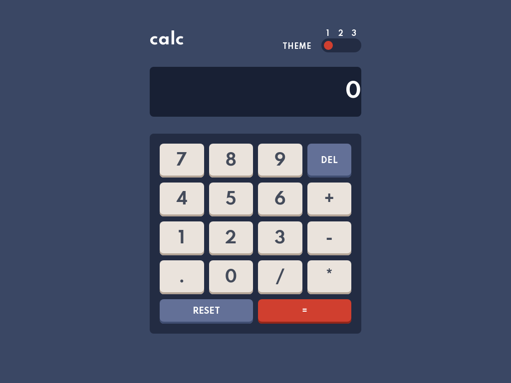

# Calculator Application

A one page web appliaction, with three color themes and four functions - addition, subtraction, division and multiplication, allowing the user to perform basic mathematical operations.

## Screenshots

## Links

• Live Site URL: (https://nerginov.github.io/Calc-app/)
## Tech Stack

• HTML5

• CSS3

• SASS

• JAVASCRIPT

## Built with 

• Mobile-first workflow

• Semantic HTML5

• CSS custom properties

• Flexbox

• Grid

• ECMAScript 6

## Resources
•(https://www.frontendmentor.io/) provided assets:

- JPEG design files for mobile & desktop layouts

- Style guide for fonts and colors

- Optimized image assets

•(https://developer.mozilla.org/)

•(https://stackoverflow.com/)
